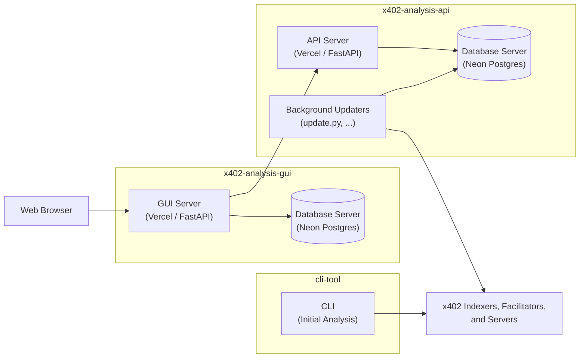

# x402analysis

Tools and analysis for the [x402](https://www.x402.org/) payment protocol ecosystem.

This repo contains three sub-projects: [cli-tool/](cli-tool), [x402-analysis-gui/](x402-analysis-gui), and [x402-analysis-api](x402-analysis-api/). The relationship of these projects is shown in the diagram below.

**[cli-tool/](cli-tool/)** : `x402tool`, a command-line tool for undertaking initial x402 ecosystem analysis. It determines a registry of known facilitators, exercising their HTTP APIs (verify, settle, supported, Coinbase's bazaar-discovery extensions), and a set of standalone analysis commands (facilitator infrastructure fingerprinting, blockchain address screening, an x402scan.com scraper, and more). See [cli-tool/README.md](cli-tool/README.md) for full usage.

**[x402-analysis-gui/](x402-analysis-gui/)** : a website that wraps the API. It is Auth0-gated and deployed on Vercel. The public landing page is at `/`, and there is an authenticated `/dashboard` page. See  [x402-analysis-gui/README.md](x402-analysis-gui/README.md) for setup and deployment. Sign-up to Auth0 to be able to request access to the dashboard.

**[x402-analysis-api/](x402-analysis-api/)** — an API server (Python/FastAPI on Vercel, Neon-backed) providing programmatic access to x402 ecosystem analysis data, gated by API keys stored in the database. See [x402-analysis-api/README.md](x402-analysis-api/README.md) for setup and deployment, and [x402-analysis-api/API.md](x402-analysis-api/API.md) for the request/response contract. 

Note: At present, _cron_ job style tasks to update the API server's database are executed as Python scripts external to the server. This has been done to minimize the Vercel and Neon spend.
